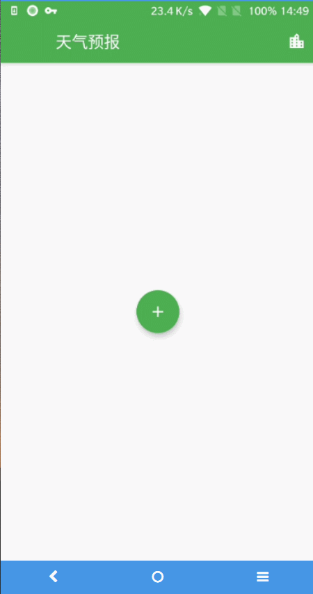
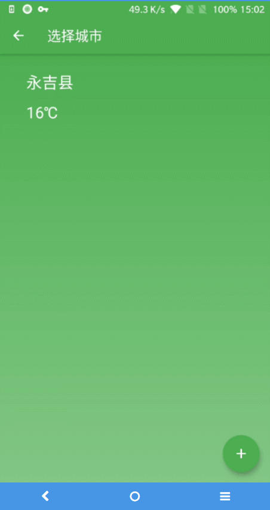

# weather

## 介绍
一个用Flutter开发的简单天气预报应用。

主要使用Bloc改变widget状态，刷新页面。

主界面框架：PageView+SingleChildScrollView（纵向滚动）+SingleChildScrollView（横向滚动）。

技术难点：SingleChildScrollView（横向滑动）与PageView的联动，这个交互我在网上没有找到代码样例，自己写了一个，应该还有可改进空间。

## 数据源
[https://www.sojson.com/blog/305.html](https://www.sojson.com/blog/305.html)

## Dependencies
```
dependencies:
  flutter:
    sdk: flutter
  flutter_localizations:
    sdk: flutter

  # The following adds the Cupertino Icons font to your application.
  # Use with the CupertinoIcons class for iOS style icons.
  cupertino_icons: ^0.1.2
  permission_handler: ^3.2.2
  fluttertoast: ^3.1.2
  shared_preferences: ^0.5.3+4
  json_annotation: ^2.4.0
  stack_trace: ^1.9.3
  dio: ^2.1.16
  logging: ^0.11.3+2
  intl: ^0.15.8
  connectivity: ^0.4.4

dev_dependencies:
  flutter_test:
    sdk: flutter
  build_runner: ^1.6.7
  json_serializable: ^3.1.0

```
## Screenshots



